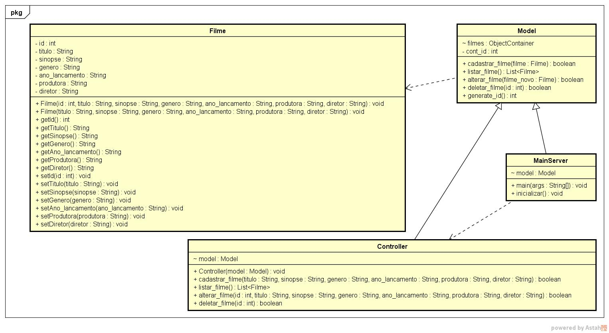

# Projeto Lab 3

<h3>Integrantes</h3>
<ul>
  <li>Cesar Ando</li>
  <li>Igor Machado</li>
</ul>

# Introdução

Este projeto é uma aplicação java web utilizando o framework Spark.

# Descrição

Este projeto é uma aplicação simples que realiza o CRUD de filmes, onde o usuário cadastra seu filme informando título, genero, produtora, diretor, ano de lançamento e a sinopse podendo realizar consultas, alterações e exclusões dos mesmos.

# Diagrama de Classe

# Tela de Cadastro

# Tela de Consulta

# Tela de Alteração
